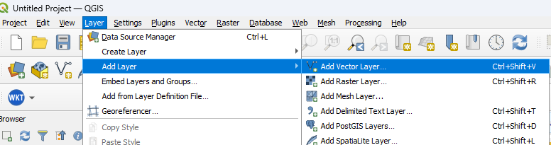

# Access with QGIS

This tutorial explains how to access and visualize the optimized building layer in GeoParquet format using **QGIS**. QGIS natively supports reading GeoParquet files.

!!! warning "Streaming visualization"
    Although GeoParquet allows streaming reading, it is not the most optimized format for visualization only. However, it is the best compromise, as streamed data contains both vector and attribute information.

    If your main use is visualization, we strongly recommend downloading the GeoParquet or pre-selecting your area of interest. Performance will be much better (see [Access with Python and GDAL](acces-python-gdal.md)).

## Installing QGIS

To access GeoParquet data in QGIS, we suggest using the following version:

* **QGIS 3.40 LTR** (Long Term Release): The stable version with the required dependencies.

!!! info "Download QGIS"
    Download and install QGIS from the official website: [https://qgis.org/download/](https://qgis.org/download/)

## Direct loading of GeoParquet

QGIS 3.40 and later versions natively support the GeoParquet format. You can load a local or remote GeoParquet file directly. In the following example, the GeoParquet hosted on the ftp will be used.

```
https://ftp.maps.canada.ca/pub/nrcan_rncan/extraction/auto_building/auto_building_opti_2/auto_building_opti_2.parquet
```

### Steps for loading

!!! info "Best practices"
    1- To facilitate streaming visualization, we strongly recommend zooming your canvas to the desired region at a scale less than 1:50,000. Otherwise, visualization may take a long time.     
    **For responsive and smooth visualization, we recommend downloading the GeoParquet file.**
    2- Set your canvas spatial reference system in advance to `EPSG:4617`. This will avoid on-the-fly reprojection.

1. **Open the Data Source Manager**  
   Go to `Layer` → `Add Layer` → `Add Vector Layer`.


*Figure: Opening the QGIS Vector Data Source Manager interface.*

2. **Source type**  
   Make sure the source type is set to `Protocol: HTTP(S), cloud, etc.`

3. **Select the protocol**  
   In the **Type** dropdown menu in the **Protocol** section, choose the `HTTP/HTTPS/FTP` option.

4. **Add the link**  
   Copy and paste the following GeoParquet link: `https://ftp.maps.canada.ca/pub/nrcan_rncan/extraction/auto_building/auto_building_opti_2/auto_building_opti_2.parquet`

5. **Add the layer**  
   Click `Add` to add the layer.


*Figure: QGIS Data Source Manager interface for adding a GeoParquet file.*

---

## Local use (downloaded file)

If you have downloaded the complete GeoParquet file to your computer, you can open it directly in QGIS:

1. **Download the file**:  
   [https://ftp.maps.canada.ca/pub/nrcan_rncan/extraction/auto_building/auto_building_opti_2/auto_building_opti_2.parquet](https://ftp.maps.canada.ca/pub/nrcan_rncan/extraction/auto_building/auto_building_opti_2/auto_building_opti_2.parquet)

2. **Open in QGIS**:  
   Follow the steps in the [Direct loading of GeoParquet](#direct-loading-of-geoparquet) section above.

---

## Troubleshooting

### Problem: "GeoParquet format not supported"

**Cause:** Your QGIS version is earlier than 3.40 or GDAL does not have GeoParquet support enabled.

**Solution:**

1. Check your QGIS version: `Help` → `About` (must be ≥ 3.40)
2. If the version is lower, update QGIS to the latest LTR: [https://qgis.org/download/](https://qgis.org/download/)

### Problem: QGIS freezes when loading the complete file

**Cause:** The complete GeoParquet file contains more than 10 million footprints, which can slow down QGIS if all data is loaded. If your canvas is empty and you are still at a scale of 1:50,000, QGIS loads the entire GeoParquet.

**Solution:**
* Make sure you have another geometry in your canvas, such as a project boundary. Then, QGIS will not load all the data.
* Alternatively, use Python/GDAL to pre-filter the data before loading it into QGIS (see [Access with Python and GDAL](acces-python-gdal.md))

---
