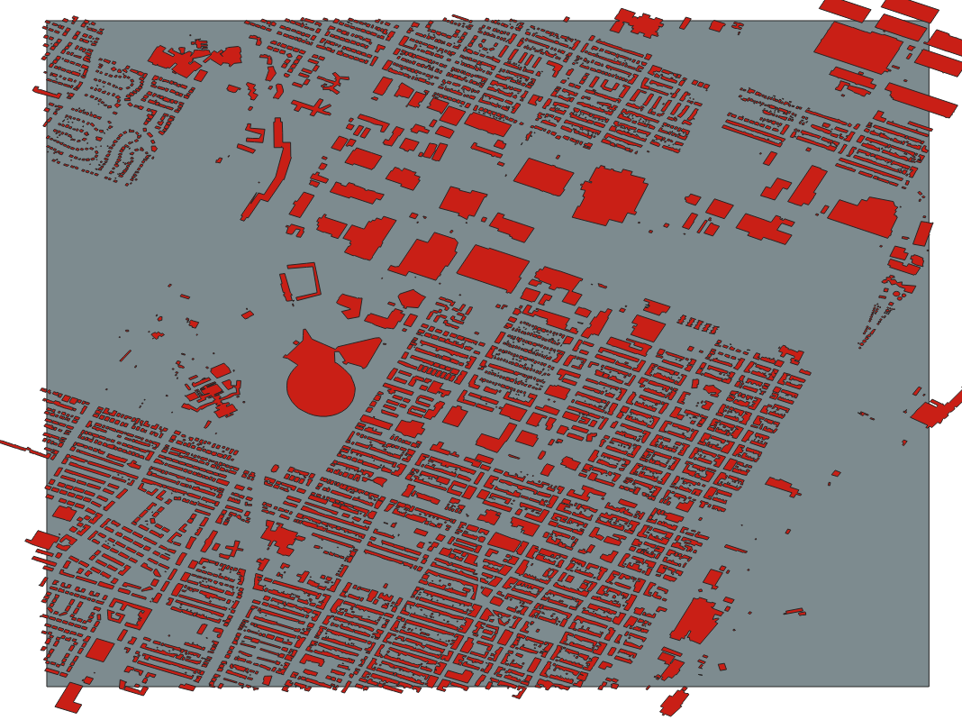

# Utilisation avec Python et GDAL

Ce tutoriel présente l'accès et la manipulation de la couche optimisée des bâtiments en format GeoParquet avec **Python (GeoPandas)** et **GDAL (ogr2ogr)**. Ces outils permettent de filtrer, transformer et exporter les données de manière efficace.

!!! info "Prérequis"
    Assurez-vous d'avoir configuré l'environnement conda `env_geoparquet` en suivant le tutoriel [Configuration de l'environnement](environment-setup.md).

!!! warning "Activation de l'environnement"
    Avant de suivre ce tutoriel, activez l'environnement conda avec :
    ```bash
    conda activate env_geoparquet    
    ```


---

## Données utilisées

La couche optimisée des bâtiments est accessible via :

* **URL S3 (pour Python/GeoPandas)** :  
  `s3://ftp-maps-canada-ca/pub/nrcan_rncan/extraction/auto_building/auto_building_opti_2/auto_building_opti_2.parquet`

* **URL /vsis3/ (pour GDAL/ogr2ogr)** :  
  `/vsis3/ftp-maps-canada-ca/pub/nrcan_rncan/extraction/auto_building/auto_building_opti_2/auto_building_opti_2.parquet`


---

## Accès avec Python (GeoPandas)

GeoPandas, combiné avec PyArrow, permet de lire efficacement les données GeoParquet avec filtrage spatial. Le GeoParquet prend en charge la lecture à la demande (lazy-read), ce qui permet de ne lire que les portions nécessaires du fichier. 

Dans une chaine de traitement, nous pouvons uniquement lire en mémoire les emprsies voulues, sans importer au complet la donnée. Très pratique lors de l'automatisation de processus d'analyses. 


### Lecture distante avec filtrage par bbox 

L'exemple suivant permet de:

1. Lire la couche GeoParquet hébergée sur S3. 
2. Appliquer un filtrage spatial lors de la lecture
3. Retourner uniquement les emprsies dans notre filtre spatial. 


Ici, nous allons charger les bâtiments pour un bbox englobant Montréal:

```python
import geopandas as gpd

# URL S3 de la couche optimisée des bâtiments
url = "s3://ftp-maps-canada-ca/pub/nrcan_rncan/extraction/auto_building/auto_building_opti_2/auto_building_opti_2.parquet"

# Définir le bbox
bbox_mtl = (-74.0073, 45.3672, -73.4466, 45.7328)

# Lecture avec pré-filtrage bbox
t0 = time.time()
gpq_subset = gpd.read_parquet(url, bbox=bbox_mtl)
t1 = time.time()

print(f"Lecture S3 + bbox: {t1-t0:.2f} s")
print(f"Nombre de bâtiments: {len(gpq_subset)}")
# Nombre d'emprises récupérées
print(f"Nombre de bâtiments dans la zone : {len(gdf)}")

# Afficher les premières lignes
print(gdf.head())
```

### Affinement avec géométrie polygonale

Dans un context où le bbox utilisé en filtrage est trop grossier, nous pouvons affiner la sélection au besoin. Il s'agit d'un exemple plus près de la réalité. Les étapes suivantes sont faites dans l'exemple: 

1. Lire la couche GeoParquet hébergée sur S3. 
2. Appliquer un filtrage spatial lors de la lecture
3. Retourner uniquement les emprsies dans notre filtre spatial. 
4. Affiner la sélection avec une géométrie voulue plus précise (peut être n'importe quelle géométrie). 


```python
import geopandas as gpd
from shapely.geometry import box

#---|1) Filtrage à la lecture |-------
# URL du GeoParquet sur S3
url = "s3://ftp-maps-canada-ca/pub/nrcan_rncan/extraction/auto_building/auto_building_opti_2/auto_building_opti_2.parquet"

# Définir la bbox (Montréal)
bbox_mtl = (-74.0073, 45.3672, -73.4466, 45.7328)

# Lecture avec pré-filtrage bbox
gpq_subset = gpd.read_parquet(url, bbox=bbox_mtl)
print(f"Nombre de bâtiments: {len(gpq_subset)}")

#---|2.1) Affinage de la sélection |-------
# Définir la limite comme un polygone (bbox)
limite = (-73.565,45.543, -73.521,45.575)
polygon_limite = box(*limite)
gdf_limite = gpd.GeoDataFrame(geometry=[polygon_limite], crs=gpq_subset.crs)

# Effectuer la sélection plus précise. 
gpq_clip = gpd.sjoin(gpq_subset, gdf_limite, predicate="intersects", how="inner")

print(f"Après intersection avec la limite: {len(gpq_clip)} bâtiments")
```

**Résultat attendu :**



*Figure : Emprises de bâtiments extraites autour du Stade Olympique de Montréal.*

### Sauvegarde des résultats

Vous pouvez exporter les données filtrées dans différents formats :

```python
# Sauvegarder en GeoPackage
gdf_affine.to_file("batiments_stade_olympique.gpkg", driver="GPKG")

# Sauvegarder en Shapefile
gdf_affine.to_file("batiments_stade_olympique.shp")

# Sauvegarder en GeoJSON
gdf_affine.to_file("batiments_stade_olympique.geojson", driver="GeoJSON")

# Sauvegarder en GeoParquet (pour conserver les performances)
gdf_affine.to_parquet("batiments_stade_olympique.parquet")
```

!!! note "Format de sortie recommandé"
    Le format **GeoParquet** est recommandé pour conserver les avantages de performance. Pour une compatibilité universelle, utilisez **GeoPackage** ou **GeoJSON**.

---

## Accès avec ogr2ogr (GDAL)

GDAL fournit l'outil en ligne de commande `ogr2ogr` pour manipuler les données vectorielles, y compris les fichiers GeoParquet.

### Format d'adresse

Pour accéder aux données distantes avec GDAL, utilisez le préfixe `/vsicurl/` :

```
/vsicurl/ftp-maps-canada-ca/pub/nrcan_rncan/extraction/auto_building/auto_building_opti_2/auto_building_opti_2.parquet
```

### Extraction avec filtrage bbox

La commande suivante extrait les emprises de bâtiments pour une zone géographique spécifique (Montréal) :

**Windows (PowerShell ou CMD) :**

```bash
ogr2ogr ^
  -f GPKG ^
  
  -spat -74.0073 45.3672 -73.4466 45.7328
```

**Linux/macOS :**

```bash
ogr2ogr \
  -f GPKG \
  
  -spat -74.0073 45.3672 -73.4466 45.7328
```

**Explications des options :**

* `-f GPKG` : Format de sortie (GeoPackage)
* `batiments_montreal.gpkg` : Nom du fichier de sortie
* `-spat minx miny maxx maxy` : Filtrage spatial par bbox

!!! tip "Formats de sortie"
    Vous pouvez changer le format de sortie avec l'option `-f` :

    - `-f Parquet` : GeoParquet

### Extraction avec filtrage par géométrie (clipsrc)

Pour découper les données avec une géométrie polygonale spécifique, utilisez l'option `-clipsrc` :

**Windows :**

```bash
ogr2ogr ^
  -f GPKG ^
  
  -clipsrc -73.565 45.543 -73.521 45.575
```

**Linux/macOS :**

```bash
ogr2ogr \
  -f GPKG \
  
  -clipsrc -73.565 45.543 -73.521 45.575
```

!!! warning "Différence entre -spat et -clipsrc"
    * `-spat` : Sélectionne les géométries dont la bbox intersecte la bbox spécifiée (plus rapide)
    * `-clipsrc` : Découpe réellement les géométries à la bbox spécifiée (plus précis mais plus lent)

### Variables d'environnement AWS (si nécessaire)

Par défaut, GDAL accède aux buckets S3 publics sans authentification. Si vous rencontrez des problèmes d'accès, vous pouvez définir les variables d'environnement suivantes :

**Windows (PowerShell) :**

```powershell
$env:AWS_NO_SIGN_REQUEST="YES"
```

**Linux/macOS :**

```bash
export AWS_NO_SIGN_REQUEST="YES"
```

---

## Utilisation en local

Si vous avez téléchargé le fichier GeoParquet localement, vous pouvez l'utiliser de la même manière en remplaçant l'URL S3 par le chemin local :

**Python :**

```python
gdf = gpd.read_parquet(
    "chemin/vers/auto_building_opti_2.parquet",
    bbox=bbox
)
```

**ogr2ogr :**

```bash
ogr2ogr -f GPKG batiments_montreal.gpkg chemin/vers/auto_building_opti_2.parquet -spat -74.0073 45.3672 -73.4466 45.7328
```

---

## Optimisations clés

Le format GeoParquet offre plusieurs avantages pour les performances :

1. **Lecture sélective (colonnes)** : GeoPandas et GDAL peuvent lire uniquement les colonnes nécessaires, réduisant les données transférées

2. **Filtrage spatial push-down** : Le filtrage par bbox est effectué côté serveur, minimisant les données téléchargées

3. **Compression efficace** : Le format Parquet utilise des algorithmes de compression avancés (Snappy, ZSTD) pour réduire la taille des fichiers

!!! tip "Best practices"
    * **Toujours utiliser un filtrage spatial** (`bbox` ou `-spat`) pour les données volumineuses
    * **Utiliser GeoParquet pour les sorties** si vous comptez réutiliser les données (performances optimales)

---

## Résumé

Ce tutoriel a présenté deux approches pour accéder à la couche optimisée des bâtiments en format GeoParquet :

* **Python (GeoPandas)** : Lecture, filtrage et export avec du code Python flexible
* **GDAL (ogr2ogr)** : Manipulation en ligne de commande pour automatisation et batch processing

!!! tip "Prochaines étapes"
    Si vous préférez une interface graphique, consultez le tutoriel [Utilisation avec QGIS](acces-qgis.md).
